# T1A3 - Terminal Application


## Introduction
For my terminal application project using the python programming language, I have chosen to create a simple user database where the user can create, retrieve, update and delete information in a JSON file within the terminal.


## Links
### Link to [Repository](https://github.com/Delarosa29/T1A3_UserData)
### Link to [Presentation]()

## Coding styles & Conventions
The coding style guideline i have tried to follow is the widely used PEP 8 for a more readable and consistent style of code. Examples would be:

### Import styling and organizing
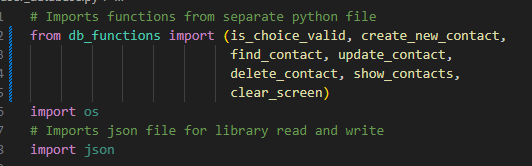


### Function naming
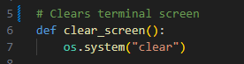


### Including comments 
Although not docstring style like PEP 8, I have added comments to explain the functions.
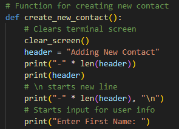 


### String Quotation / Indentation
4 Space style indentations and consistent double quotations for string elements
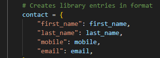


## Features of Application
### There are 5 main features of the application, These being:
1. Create a New Contact.
    - This starts the whole program as user is asked to input their details.
    - First name, Last name, Email and Mobile Number.
    - All inputs are case sensitive except for the email using the .lower() and .strip() function to avoid errors.
    - This calls to a function that will search and open or create its own JSON library depending if one already exists or not.

        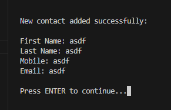

### Steps for implementing this function included:
    1. Create a function 'create_new_contact()' which would handle the retrieving and writing of a new contact.
    2. Add prompts for users name, mobile and email.
    3. It would then dump contact within JSON database.
    4. Notify user of successful creation.
    HIGH PRIORITY

    Tasks:
    Function definition
    User input handling
    Database interaction

---

2. Find a Contact
    - Find contact will ask for an email then will search the JSON file for any matching details.
    - If the entered email matches, it will retrieve from JSON and print the full details of that user in string text.

        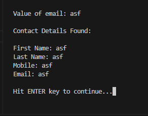
    - If it however does not, it will say to the user that the input is invalid and     prompt them to go back to menu selection.

        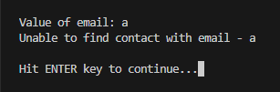

### Steps for implementing this function included:
    1. Create a function 'find_contact()' to read JSON file.
    2. Ask user for input
    3. Display contact details if found
    LOW PRIORITY

    Tasks:
    Function definition
    User input handling
    Database interaction
    Display contact details


---


3. Update a Contact
    - Similar to finding a contact, user will be prompted to input an email and will search JSON file for matching details.
    - The update feature however, upon successful match of a registered email will give user the ability to re-enter the First name, Last name and Mobile number of the entry. Overwriting the existing entry stored within the JSON file.
    - After user has input the new details, it will then display a comparison between the previous and the newer entry to confirm.

        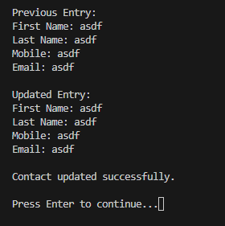

    
### Steps for implementing this function included:
    1. Create a function 'update_contact(email)' to update an existing contact
    2. Prompt user for email input
    3. Prompt user for detail input again
    4. Overwrite current contact in database
    5. Display the confirmed changes alongside previous entry.
    MEDIUM PRIORITY

    Tasks:
    Function Definition
    User input handling
    Database interaction
    Display both previous and updated entry

---


4. Delete a Contact
    - Delete feature will ask user for an email.
    - If the email matches it will delete from JSON file and display the information of the matching email user info. Followed by a prompt to return to menu selection.
        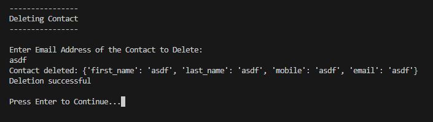
    - If input does not match any emails, it will display that it is unable to find and prompt user back to menu selection.

        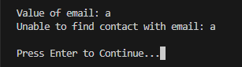

### Steps for implementing this function included:
    1. Create function 'delete_contact()' to delete a contact of matching email
    2. Ask user for email input
    3. Remove matching contact from database
    HIGH PRIORITY

    Tasks:
    Function definition
    User input handling
    Database interaction

---


5. Show Whole Database 
    - Similar to find a contact, this retrieves all entries from JSON file and prints it out in the format it was set and stored in.
    - Followed by user input to return back to menu selection.
        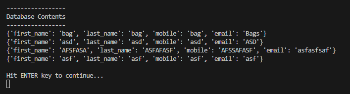

### Steps for implementing this function included:
    1. Create function 'show_contacts()' to display all contacts
    2. Load contacts from JSON file and display all entries
    LOW PRIORITY

    Tasks:
    Function definition
    Database retrieval
    Display contacts


---


6. Exit Function
    - Simple exit function which breaks out of loop and prints a farewell to the user upon selection.

        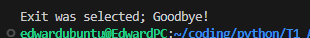

## Help documentation

### Installation

1. Copy the files into a temporary directory, e.g., /home/edwardubunut/tmp
- db_functions.py
- install.sh
- readme.md
- simple_db.json
- user_database.py
2. Run the install.sh file using the /bin/sh command
```
$ /bin/sh install.sh
```
NOTE: The command above will first check whether Python3 is present in the runtime environment. If not, the installation script will attempt to download the python3 package and install it.

Final Product: When the installation is completed, it will create a folder called `app` which contains the executable file named `user_database.py`.

The user can execute the app using the following command:
```
$ ./user_database.py
```

### Additional Information - Making A File Executable

Making the Python script executable involves two steps.
1. Include following directive (on line 1)
Determine the current Python executable using `which` command
```
$ which python3
/usr/bin/python3
```
include the following directive in your Python code (line 1)
```
#!/usr/bin/python3
```

2. Add `execute` file mode using the chmod command
```
$ chmod u+x user_database.py
```
Where: u+x - means only give executable to the currently logged-in user

Note: Run the `chmod` command using sudo if file is located in a privileged folder (e.g., /opt)


